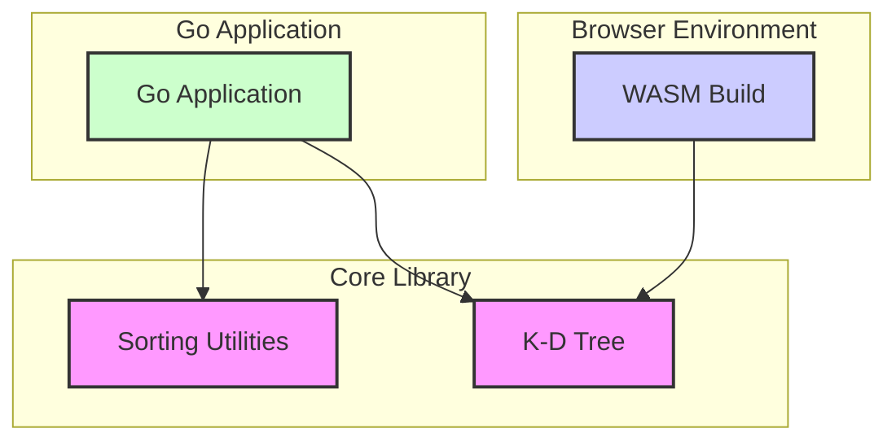

# Architecture

This document provides a high-level overview of the Poindexter library's architecture.

## System Overview

Poindexter is a Go library that provides a collection of utility functions, with a primary focus on sorting algorithms and a K-D tree implementation for nearest neighbor searches. The library is designed to be modular, with distinct components for different functionalities.

The main components of the Poindexter library are:

- **Sorting Utilities:** A set of functions for sorting slices of various data types, including integers, strings, and floats. It also provides generic functions for custom sorting.
- **K-D Tree:** A K-D tree implementation for efficient nearest neighbor searches in a multi-dimensional space.
- **WASM Build:** A WebAssembly build that allows the K-D tree to be used in browser environments.

## Component Diagram

The following diagram illustrates the high-level components of the Poindexter library and their relationships:

### Components

- **Sorting Utilities:** This component contains all the sorting-related functions. It is used by Go applications that need to perform sorting operations.
- **K-D Tree:** This component provides the K-D tree implementation. It is used by Go applications and is also the core component exposed in the WASM build.
- **WASM Build:** This component is a wrapper around the K-D tree that compiles it to WebAssembly, allowing it to be used in web browsers.
- **Go Application:** Any Go application that imports the Poindexter library to use its sorting or K-D tree functionalities.
